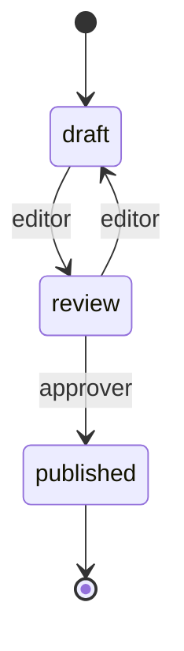

# Workflow System Implementation Plan

## Overview
Implement a declarative state-based workflow system for mysql-vfs using **directory-as-state** architecture. Files are governed by workflows when they reside within a directory tree containing a `.workflow` file. The workflow engine acts as a **hard constraint** in the domain layer, blocking all non-compliant operations.

## Core Principles

1. **Directory-as-State**: File state is determined by its directory path, not database columns
2. **Hard Constraint**: Workflow rules CANNOT be bypassed by users or admins (only system-admin)
3. **Layered Enforcement**: Workflow validation occurs in domain layer BEFORE authorization
4. **No Escape**: Files cannot be moved outside workflow scope; only between defined states
5. **Gated Deletion**: Files can only be deleted if workflow defines deletion gates
6. **State Directory Protection**: State directories cannot be renamed/deleted while workflow is active

---

## Phase 1: Workflow Audit Log Model

### 1.1 Create Workflow Audit Log Model
**New file:** `pkg/models/workflow_audit.go`

**Purpose**: Track workflow transitions for audit trail (NOT for state storage)

**Structures:**
```go
type WorkflowAudit struct {
    ID              string
    FilePath        string
    WorkflowPath    string  // Path to .workflow file
    FromState       string
    ToState         string
    Operation       string  // "move", "delete", "create"
    Actor           string
    ActorGroups     []string
    GatesEvaluated  []string
    Success         bool
    ErrorMessage    *string
    CreatedAt       time.Time
}
```

**Note**: This is for audit/analytics only. File state is derived from path, not stored.

---

## Phase 2: Workflow Special File & Loader

### 2.1 Register `.workflow` Special File Type
**File:** `pkg/domain/special_files.go`

**Add:**
```go
SpecialFileTypeWorkflow SpecialFileType = ".workflow"
```

**Registry entry:**
```go
SpecialFileTypeWorkflow: {
    Name:              SpecialFileTypeWorkflow,
    Description:       "Workflow definition - state machine for files",
    ContentType:       "application/x-yaml",
    AdminOnly:         false, // Users can create workflows in their directories
    ValidateFunc:      validateWorkflowConfig,
    InheritFromParent: false, // NO nesting - only one .workflow per tree
},
```

### 2.1.1 Workflow Validation Schema

**JSON Schema for `.workflow` files:**

```json
{
  "$schema": "http://json-schema.org/draft-07/schema#",
  "title": "Workflow Definition",
  "type": "object",
  "required": ["state_directories", "initial_state", "states"],
  "properties": {
    "state_directories": {
      "type": "object",
      "description": "Mapping of state names to directory paths (relative to workflow home)",
      "minProperties": 1,
      "patternProperties": {
        "^[a-z0-9][a-z0-9_-]*$": {
          "type": "string",
          "pattern": "^[a-zA-Z0-9_/-]+$",
          "minLength": 1,
          "maxLength": 255
        }
      },
      "additionalProperties": false
    },
    "initial_state": {
      "type": "string",
      "description": "State where files must be created",
      "pattern": "^[a-z0-9][a-z0-9_-]*$"
    },
    "states": {
      "type": "object",
      "description": "State definitions",
      "minProperties": 1,
      "patternProperties": {
        "^[a-z0-9][a-z0-9_-]*$": {
          "type": "object",
          "properties": {
            "transitions": {
              "type": "array",
              "items": {
                "type": "object",
                "required": ["to", "gates"],
                "properties": {
                  "to": {
                    "type": "string",
                    "pattern": "^[a-z0-9][a-z0-9_-]*$"
                  },
                  "gates": {
                    "type": "array",
                    "minItems": 1,
                    "items": {
                      "type": "object",
                      "required": ["type"],
                      "properties": {
                        "type": {
                          "type": "string",
                          "enum": ["group", "metadata", "rego", "composite"]
                        },
                        "groups": {
                          "type": "array",
                          "items": {"type": "string"}
                        },
                        "conditions": {
                          "type": "object"
                        },
                        "policy": {
                          "type": "string"
                        },
                        "operator": {
                          "type": "string",
                          "enum": ["AND", "OR"]
                        },
                        "gates": {
                          "type": "array",
                          "items": {"$ref": "#/properties/states/patternProperties/%5E%5Ba-z0-9%5D%5Ba-z0-9_-%5D*%24/properties/transitions/items/properties/gates/items"}
                        }
                      }
                    }
                  },
                  "on_success": {
                    "type": "array",
                    "items": {
                      "type": "object",
                      "required": ["type"],
                      "properties": {
                        "type": {
                          "type": "string",
                          "enum": ["webhook", "metadata_update", "cache_invalidate"]
                        }
                      }
                    }
                  }
                }
              }
            },
            "deletion_gate": {
              "type": "object",
              "required": ["type"],
              "properties": {
                "type": {
                  "type": "string",
                  "enum": ["group", "metadata", "rego", "composite"]
                }
              }
            }
          }
        }
      },
      "additionalProperties": false
    }
  }
}
```

### 2.1.2 Validation Rules

**`validateWorkflowConfig` function must check:**

1. **YAML Syntax**
   - Valid YAML structure
   - Parse without errors

2. **JSON Schema Compliance**
   - Validate against schema above
   - Check all required fields present
   - Validate data types

3. **State Name Constraints**
   - Pattern: `^[a-z0-9][a-z0-9_-]*$`
   - Must start with lowercase letter or digit
   - Only lowercase alphanumeric, underscore, hyphen
   - Max length: 64 characters

4. **State Directory Constraints**
   - Paths relative to workflow home
   - Pattern: `^[a-zA-Z0-9_/-]+$`
   - Max depth: 5 levels
   - Max length: 255 characters
   - No `.` or `..` components
   - No leading or trailing slashes

5. **Reference Integrity**
   - `initial_state` must exist in `states` map
   - All `state_directories` keys must exist in `states` map
   - All transition `to` states must exist in `states` map
   - No orphaned states (states not in `state_directories`)

6. **Workflow Nesting**
   - No `.workflow` file exists in parent directories
   - No `.workflow` files exist in child directories

7. **State Directory Existence** (filesystem validation)
   - All paths in `state_directories` must exist as directories
   - Directories must be empty or contain only valid files
   - Cannot be special file directories (e.g., not `.rego`, `.events`)

8. **Gate Type Validation**
   - `group`: Must have `groups` array
   - `metadata`: Must have `conditions` object
   - `rego`: Must have `policy` string
   - `composite`: Must have `operator` and `gates` array

9. **Circular Reference Detection**
   - No self-referencing states in composite gates
   - State machine must be a valid DAG (warn if cycles detected)

### 2.1.3 Validation Errors

**Error codes returned:**

```go
const (
    ErrInvalidYAML              = "WORKFLOW_INVALID_YAML"
    ErrSchemaViolation          = "WORKFLOW_SCHEMA_VIOLATION"
    ErrInvalidStateName         = "WORKFLOW_INVALID_STATE_NAME"
    ErrInvalidStatePath         = "WORKFLOW_INVALID_STATE_PATH"
    ErrInitialStateNotFound     = "WORKFLOW_INITIAL_STATE_NOT_FOUND"
    ErrTransitionStateNotFound  = "WORKFLOW_TRANSITION_STATE_NOT_FOUND"
    ErrStateDirectoryNotFound   = "WORKFLOW_STATE_DIR_NOT_FOUND"
    ErrOrphanedState            = "WORKFLOW_ORPHANED_STATE"
    ErrNestedWorkflow           = "WORKFLOW_NESTING_PROHIBITED"
    ErrInvalidGateType          = "WORKFLOW_INVALID_GATE_TYPE"
    ErrMissingGateConfig        = "WORKFLOW_MISSING_GATE_CONFIG"
)
```

**Example error response:**

```json
{
  "error": "WORKFLOW_INITIAL_STATE_NOT_FOUND",
  "message": "initial_state 'draft' does not exist in states map",
  "details": {
    "initial_state": "draft",
    "available_states": ["review", "published"]
  }
}
```

### 2.2 Create Workflow Loader
**New file:** `pkg/domain/workflow_loader.go`

**Responsibilities:**
- Parse YAML `.workflow` files
- Cache with 5-minute TTL (like other loaders)
- Walk up directory tree to find governing workflow (lookup, not inheritance)
- Validate workflow definitions
- Extract state from file path based on `state_directories` mapping

**Data structures:**
```go
type WorkflowDefinition struct {
    WorkflowPath      string                      // Path to .workflow file
    WorkflowHome      string                      // Directory containing .workflow
    StateDirectories  map[string]string           // state_name → relative_path
    InitialState      string
    States            map[string]StateDefinition
    AllowDeletion     bool                        // Global deletion gate
}

type StateDefinition struct {
    Transitions  []TransitionDefinition
    DeletionGate *GateDefinition  // Optional state-specific deletion gate
}

type TransitionDefinition struct {
    To    string
    Gates []GateDefinition
}

type GateDefinition struct {
    Type   string                 // "group", "metadata", "rego", "composite"
    Config map[string]interface{}
}
```

**Key methods:**
```go
// LoadForPath finds the workflow governing this file path
func (l *WorkflowLoader) LoadForPath(ctx context.Context, filePath string) (*WorkflowDefinition, error)

// GetCurrentState extracts state from file path using state_directories mapping
func (w *WorkflowDefinition) GetCurrentState(filePath string) (string, error)

// IsStateDirectory checks if this directory is a state directory
func (w *WorkflowDefinition) IsStateDirectory(dirPath string) bool

// GetStateDirectoryPath returns the absolute path for a state
func (w *WorkflowDefinition) GetStateDirectoryPath(stateName string) (string, error)
```

---

## Phase 3: Workflow Engine

### 3.1 Create Workflow Engine Service
**New file:** `pkg/domain/workflow_engine.go`

**Purpose**: Hard constraint enforcer - validates ALL file operations against workflow rules

**Core functions:**
```go
// ValidateMoveOperation checks if file can be moved from source to destination
func (e *WorkflowEngine) ValidateMoveOperation(
    ctx context.Context,
    sourcePath string,
    destPath string,
    actor string,
    actorGroups []string,
    fileMetadata map[string]interface{},
) error

// ValidateCreateOperation checks if file can be created at path
func (e *WorkflowEngine) ValidateCreateOperation(
    ctx context.Context,
    filePath string,
    actor string,
    actorGroups []string,
) error

// ValidateDeleteOperation checks if file can be deleted
func (e *WorkflowEngine) ValidateDeleteOperation(
    ctx context.Context,
    filePath string,
    actor string,
    actorGroups []string,
    fileMetadata map[string]interface{},
) error

// ValidateDirectoryOperation checks if directory can be renamed/deleted
func (e *WorkflowEngine) ValidateDirectoryOperation(
    ctx context.Context,
    dirPath string,
    operation string, // "rename", "delete"
) error

// GetValidTransitions returns list of valid target states from current location
func (e *WorkflowEngine) GetValidTransitions(
    ctx context.Context,
    filePath string,
    actor string,
    actorGroups []string,
) ([]string, error)
```

**Key behaviors:**
1. **File Move**: Extract fromState and toState from paths, validate transition exists and gates pass
2. **File Create**: Must be in initial_state directory
3. **File Delete**: Check global AllowDeletion or state-specific DeletionGate
4. **Directory Ops**: Block rename/delete of state directories
5. **Escape Prevention**: Reject moves outside workflow scope

### 3.2 Gate Evaluators
**New file:** `pkg/domain/workflow_gates.go`

**Implement gate types:**

```go
type GateEvaluator interface {
    Evaluate(ctx context.Context, input *GateInput) (bool, error)
}

type GateInput struct {
    Actor           string
    ActorGroups     []string
    FileMetadata    map[string]interface{}
    FromState       string
    ToState         string
    WorkflowDef     *WorkflowDefinition
}
```

**Gate implementations:**
- **group**: Check if actor is in specified group(s)
- **metadata**: Check file metadata attributes match conditions
- **rego**: Execute custom Rego policy for complex rules
- **composite**: Combine multiple gates with AND/OR logic

---

## Phase 4: Service Layer Integration (Critical)

### 4.1 Integrate into FileService
**File:** `pkg/domain/file_service.go`

**Integration points:**

```go
func (s *FileService) CreateFile(ctx context.Context, path string, content []byte, user string) error {
    // WORKFLOW CHECK - BEFORE any other validation
    if err := s.workflowEngine.ValidateCreateOperation(ctx, path, user, getUserGroups(user)); err != nil {
        return fmt.Errorf("workflow validation failed: %w", err)
    }

    // Continue with normal file creation...
}

func (s *FileService) MoveFile(ctx context.Context, sourcePath, destPath string, user string) error {
    // Load file metadata for gate evaluation
    file, _ := s.GetFile(ctx, sourcePath)

    // WORKFLOW CHECK - BEFORE authorization
    if err := s.workflowEngine.ValidateMoveOperation(
        ctx, sourcePath, destPath, user, getUserGroups(user), file.Metadata,
    ); err != nil {
        return fmt.Errorf("workflow validation failed: %w", err)
    }

    // Continue with normal move...
    // Emit workflow.transition.succeeded event
}

func (s *FileService) DeleteFile(ctx context.Context, path string, user string) error {
    // Load file metadata
    file, _ := s.GetFile(ctx, path)

    // WORKFLOW CHECK
    if err := s.workflowEngine.ValidateDeleteOperation(
        ctx, path, user, getUserGroups(user), file.Metadata,
    ); err != nil {
        return fmt.Errorf("workflow validation failed: %w", err)
    }

    // Continue with deletion...
}
```

### 4.2 Integrate into DirectoryService
**File:** `pkg/domain/directory_service.go`

**Integration points:**

```go
func (s *DirectoryService) RenameDirectory(ctx context.Context, oldPath, newPath string) error {
    // WORKFLOW CHECK - prevent state directory renames
    if err := s.workflowEngine.ValidateDirectoryOperation(ctx, oldPath, "rename"); err != nil {
        return fmt.Errorf("cannot rename state directory: %w", err)
    }

    // Continue with rename...
}

func (s *DirectoryService) DeleteDirectory(ctx context.Context, path string) error {
    // WORKFLOW CHECK - prevent state directory deletion
    if err := s.workflowEngine.ValidateDirectoryOperation(ctx, path, "delete"); err != nil {
        return fmt.Errorf("cannot delete state directory: %w", err)
    }

    // Continue with deletion...
}
```

**Critical**: Workflow validation must occur BEFORE authorization to act as gatekeeper.

---

## Phase 5: Event System Integration

### 5.1 Add Workflow Event Types
**File:** `pkg/events/lifecycle_types.go`

**New event types:**
```go
const (
    EventWorkflowTransitionStarted   = "workflow.transition.started"
    EventWorkflowTransitionSucceeded = "workflow.transition.succeeded"
    EventWorkflowTransitionFailed    = "workflow.transition.failed"
    EventWorkflowDeletionBlocked     = "workflow.deletion.blocked"
    EventWorkflowEscapeBlocked       = "workflow.escape.blocked"
)
```

### 5.2 Add `move_file` Action Type for Auto-Transitions
**Files:**
- `pkg/domain/events_loader.go`
- `pkg/domain/event_dispatcher.go`

**Implementation:**
```go
type MoveFileAction struct {
    Type         string  // "move_file"
    TargetState  string  // Target state name (not full path)
    PreserveStructure bool  // Default: true
}
```

**Example usage:**
```yaml
# .events file
handlers:
  - name: auto-approve-small-files
    events: [file.create.succeeded]
    type: move_file
    config:
      target_state: approved
      preserve_structure: true
    condition: input.file.size < 1000000  # < 1MB
```

**Behavior:**
1. Event triggers `move_file` action
2. Dispatcher calls `FileService.MoveFile()` with constructed path
3. Move goes through normal workflow validation
4. If gates fail, emit `workflow.transition.failed` event

---

## Phase 6: Authorization Integration (Optional Enhancement)

### 6.1 Add WorkflowContext to AuthorizationInput
**File:** `pkg/middleware/authorization.go`

**Purpose**: Allow OPA policies to add ADDITIONAL constraints on top of workflow gates

**Changes:**
```go
type AuthorizationInput struct {
    // ... existing fields
    Workflow *WorkflowContext `json:"workflow,omitempty"`
}

type WorkflowContext struct {
    Active         bool     `json:"active"`          // Is file governed by workflow?
    CurrentState   string   `json:"current_state"`   // Current state from path
    TargetState    string   `json:"target_state"`    // Target state (for moves)
    ValidStates    []string `json:"valid_states"`    // States user CAN transition to
}
```

**When to inject:**
- Extract from file path during authorization check
- Only when `.workflow` file exists in parent tree

**Example Rego policy (additional layer on top of workflow):**
```rego
# Senior approvers can expedite high-priority documents
allow {
    input.action == "move"
    input.workflow.current_state == "draft"
    input.workflow.target_state == "published"  # Skip review
    input.user.groups[_] == "senior-approver"
    input.resource.metadata.priority == "high"
}

# Note: This still requires workflow gates to pass
# Authorization provides ADDITIONAL constraints, not replacements
```

**Important**: Workflow engine validates FIRST, then authorization can add more restrictions

---

## Phase 7: API Endpoints

### 7.1 Add Workflow Utility Endpoints
**New file:** `services/vfs/handlers/workflow.go`

**Endpoints:**
```
GET    /api/v1/workflows/:path/info         - Get workflow info for file path
GET    /api/v1/workflows/:path/transitions  - Get valid next states for current user
POST   /api/v1/workflows/:path/next         - Move file to target state (preserves structure)
```

**Endpoint details:**

**GET /api/v1/workflows/:path/info**
```json
{
  "workflow_active": true,
  "workflow_path": "/documents/.workflow",
  "current_state": "draft",
  "state_directory": "/documents/drafts",
  "initial_state": "draft"
}
```

**GET /api/v1/workflows/:path/transitions**
```json
{
  "current_state": "draft",
  "valid_transitions": [
    {
      "state": "review",
      "gates": ["group:editor"],
      "can_transition": true
    },
    {
      "state": "published",
      "gates": ["group:approver"],
      "can_transition": false,
      "reason": "User not in required group"
    }
  ]
}
```

**POST /api/v1/workflows/:path/next**
```json
Request:
{
  "target_state": "review"
}

Response:
{
  "old_path": "/documents/drafts/legal/contract.pdf",
  "new_path": "/documents/review/legal/contract.pdf",
  "transition": "draft → review"
}
```

---

## Phase 8: Testing

### 8.1 Unit Tests
**New files:**
- `pkg/domain/workflow_loader_test.go`
- `pkg/domain/workflow_engine_test.go`
- `pkg/domain/workflow_gates_test.go`

**Key test cases:**

**Workflow Loader:**
- Parse valid YAML workflows
- Reject invalid state names
- Extract current state from file paths
- Handle state_directories with nested paths
- Validate no nested workflows

**Workflow Engine:**
- Allow valid transitions
- Block invalid transitions
- Enforce initial_state on create
- Block escapes (moves outside workflow)
- Block state directory rename/delete
- Evaluate all gate types
- Enforce deletion gates

### 8.2 Integration Tests
**New file:** `citest/e2e_workflow_test.go`

**Test scenarios:**

1. **Document Approval Workflow**
   - Create file in drafts/ (initial_state)
   - Move to review/ (requires editor group)
   - Move to published/ (requires approver group)
   - Attempt invalid draft → published (blocked)

2. **Escape Prevention**
   - Attempt to move file outside workflow scope (blocked)
   - Attempt to move to undefined state (blocked)

3. **Deletion Gates**
   - Delete file with deletion gate (passes)
   - Delete file without deletion gate (blocked)

4. **State Directory Protection**
   - Attempt to rename state directory (blocked)
   - Attempt to delete non-empty state directory (blocked)

5. **Event-Triggered Transitions**
   - File upload triggers auto-move via `.events`
   - Gate failure prevents auto-move

6. **Subdirectory Structure Preservation**
   - Move /drafts/legal/2025/file.pdf to review
   - Verify result: /review/legal/2025/file.pdf

7. **system-admin Bypass**
   - system-admin can bypass workflow gates
   - system-admin can rename state directories

---

## Phase 9: Documentation

### 9.1 Update Documentation
**Files to update:**
- `docs/DESIGN.md` - Add workflow architecture section
- `docs/SECURITY.md` - Document workflow + authorization layering
- Create `docs/WORKFLOWS.md` - Comprehensive workflow guide

**Include:**
- Directory-as-state architecture explanation
- Workflow YAML reference (state_directories, gates)
- Gate types documentation (group, metadata, rego, composite)
- Example workflows (document approval, build pipeline, moderation)
- API reference (info, transitions, next endpoints)
- Troubleshooting guide (common errors, debugging)
- Migration guide (adding workflows to existing directories)

---

## Implementation Order (Recommended)

1. **Phase 1** - Workflow audit model (optional, for analytics)
2. **Phase 2** - Workflow special file registration & loader
3. **Phase 3** - Workflow engine & gate evaluators
4. **Phase 8.1** - Unit tests (validate engine works in isolation)
5. **Phase 4** - Service layer integration (FileService, DirectoryService)
6. **Phase 5** - Event system integration (workflow events, move_file action)
7. **Phase 7** - API endpoints (info, transitions, next)
8. **Phase 8.2** - Integration tests (end-to-end workflows)
9. **Phase 6** - Authorization integration (optional enhancement)
10. **Phase 9** - Documentation

**Note**: Phase 4 (Service Integration) is CRITICAL and must be done carefully to ensure workflow validation happens before authorization.

---

## Key Design Decisions

### ✅ Directory-as-State Architecture
- State is implicit in file path, not stored in database
- Eliminates state synchronization issues
- Natural filesystem semantics (mv = transition)
- No database migrations needed

### ✅ Workflow Engine as Hard Constraint
- Workflow validation happens **before** authorization
- NO bypass for users/admins (only system-admin)
- Files CANNOT escape workflow scope
- State directories CANNOT be renamed/deleted while active

### ✅ No Nested Workflows
- Only one `.workflow` per directory tree
- Prevents state ambiguity
- Simple mental model
- Use top-level organization for multiple workflows

### ✅ Explicit State Directory Mapping
- `state_directories` maps state names to paths
- Supports flexible naming (draft → drafts, work-in-progress, etc.)
- Supports nested state paths (review/pending)
- Clear, unambiguous state resolution

### ✅ YAML DSL for Workflows
- Human-readable, version-controllable
- Consistent with infrastructure-as-code
- Easy to validate and parse

### ✅ Gate System for Flexibility
- Multiple gate types (group, metadata, rego, composite)
- Composable and extensible
- Allows complex business rules

### ✅ Structure Preservation
- Subdirectories within states preserved during transitions
- `next` command automates structure-preserving moves
- Supports organizational hierarchy within states

---

## Files to Create (Summary)

**Models (Optional):**
- `pkg/models/workflow_audit.go` (audit log for transitions)

**Domain:**
- `pkg/domain/workflow_loader.go` (parse YAML, cache, extract state from path)
- `pkg/domain/workflow_engine.go` (validate operations, enforce constraints)
- `pkg/domain/workflow_gates.go` (gate evaluators: group, metadata, rego, composite)

**Handlers:**
- `services/vfs/handlers/workflow.go` (API endpoints: info, transitions, next)

**Tests:**
- `pkg/domain/workflow_loader_test.go`
- `pkg/domain/workflow_engine_test.go`
- `pkg/domain/workflow_gates_test.go`
- `citest/e2e_workflow_test.go`

**Docs:**
- `docs/WORKFLOWS.md` (comprehensive workflow guide)

**Files to Modify:**

**Critical (Core Functionality):**
- `pkg/domain/special_files.go` - Register `.workflow` special file type
- `pkg/domain/file_service.go` - Add workflow validation to CreateFile, MoveFile, DeleteFile
- `pkg/domain/directory_service.go` - Add workflow validation to RenameDirectory, DeleteDirectory
- `pkg/events/lifecycle_types.go` - Add workflow event constants

**Optional (Enhancement):**
- `pkg/middleware/authorization.go` - Add WorkflowContext to OPA input
- `pkg/domain/events_loader.go` - Add `move_file` action type
- `pkg/domain/event_dispatcher.go` - Implement `move_file` action handler

**Documentation:**
- `docs/DESIGN.md` - Add workflow architecture section
- `docs/SECURITY.md` - Document workflow + authorization layering

---

## Estimated Effort & Risk

**Estimated Effort:** 12-15 hours of focused development

**Complexity:** Medium (simpler than original plan - no database changes, no scheduler integration)

**Risk:** Low-Medium
- **Low Risk**: Additive feature, no database migrations, doesn't break existing functionality
- **Medium Risk**: Must integrate carefully into FileService/DirectoryService to ensure workflow validation happens before authorization

---

## Example Use Cases

### Use Case 1: Document Approval Process
```yaml
# /documents/.workflow
state_directories:
  draft: "drafts"
  review: "in-review"
  published: "published"

initial_state: draft

states:
  draft:
    transitions:
      - to: review
        gates:
          - type: group
            groups: [editor, admin]
  review:
    transitions:
      - to: published
        gates:
          - type: group
            groups: [approver, admin]
      - to: draft
        gates:
          - type: group
            groups: [editor, admin]
  published:
    transitions: []
    deletion_gate:
      type: group
      groups: [admin]
```

**Directory Structure:**
```
/documents/
├── .workflow
├── drafts/
│   ├── legal/
│   │   └── contract.pdf
│   └── marketing/
│       └── proposal.pdf
├── in-review/
│   └── legal/
│       └── agreement.pdf
└── published/
    └── marketing/
        └── brochure.pdf
```

**Flow:**
1. User creates `/documents/drafts/legal/contract.pdf` (initial_state)
2. Editor runs: `mv /documents/drafts/legal/contract.pdf /documents/in-review/legal/contract.pdf`
   - Workflow validates: draft → review transition, checks editor group
3. Approver runs: `mv /documents/in-review/legal/contract.pdf /documents/published/legal/contract.pdf`
   - Workflow validates: review → published transition, checks approver group
4. Attempt to delete published file blocked unless user is admin

### Use Case 2: Software Build Pipeline with Auto-Transitions
```yaml
# /builds/.workflow
state_directories:
  building: "building"
  testing: "testing"
  deployed: "deployed"

initial_state: building

states:
  building:
    transitions:
      - to: testing
        gates:
          - type: metadata
            conditions:
              build_status: success
  testing:
    transitions:
      - to: deployed
        gates:
          - type: composite
            operator: AND
            gates:
              - type: metadata
                conditions:
                  test_status: passed
              - type: group
                groups: [release-manager]
      - to: building  # Retry on failure
        gates:
          - type: metadata
            conditions:
              test_status: failed
  deployed:
    transitions: []
```

**Auto-transition via events:**
```yaml
# /builds/.events
handlers:
  - name: auto-transition-on-build-success
    events: [file.metadata.updated]
    type: move_file
    config:
      target_state: testing
      preserve_structure: true
    condition: |
      input.metadata.build_status == "success"
```

### Use Case 3: Content Moderation with Deletion Gates
```yaml
# /user-content/.workflow
state_directories:
  pending: "pending-review"
  approved: "approved"
  rejected: "rejected"

initial_state: pending

states:
  pending:
    transitions:
      - to: approved
        gates:
          - type: group
            groups: [moderator, admin]
      - to: rejected
        gates:
          - type: group
            groups: [moderator, admin]
    deletion_gate:
      type: group
      groups: [admin]  # Only admins can delete pending content

  approved:
    transitions:
      - to: rejected
        gates:
          - type: group
            groups: [admin]  # Only admins can unapprove
    deletion_gate:
      type: group
      groups: [admin]

  rejected:
    transitions:
      - to: pending
        gates:
          - type: group
            groups: [admin]  # Allow re-review
    deletion_gate:
      type: group
      groups: [moderator, admin]  # Moderators can delete rejected content
```

---

## System Integration Architecture

### 1. Domain Layer (Workflow Engine)
**Location:** `pkg/domain/workflow_engine.go`

**Responsibility:** Hard constraint enforcement

**Integration point:**
```go
// FileService.CreateFile()
func (s *FileService) CreateFile(ctx, path, content, user) error {
    // STEP 1: Workflow validation (FIRST)
    if err := workflowEngine.ValidateCreateOperation(...); err != nil {
        return ErrWorkflowViolation
    }

    // STEP 2: Authorization (SECOND)
    if err := authorize(user, "create", path); err != nil {
        return ErrUnauthorized
    }

    // STEP 3: Business logic
    // ...
}
```

**Key principle:** Workflow validates BEFORE authorization

### 2. Authorization Layer Integration (Optional)
**File:** `pkg/middleware/authorization.go`

**Purpose:** Add context for OPA policies to make workflow-aware decisions

**Inject workflow context:**
```json
{
  "user": {"id": "alice", "groups": ["editor"]},
  "resource": {"path": "/documents/drafts/contract.pdf"},
  "action": "move",
  "workflow": {
    "active": true,
    "current_state": "draft",
    "target_state": "published",
    "valid_states": ["review"]
  }
}
```

**Example policy (adds constraints ON TOP of workflow):**
```rego
# Senior approvers can expedite high-priority docs (workflow gates must still pass)
allow {
    input.action == "move"
    input.workflow.current_state == "draft"
    input.workflow.target_state == "published"
    input.user.groups[_] == "senior-approver"
    input.resource.metadata.priority == "critical"
}
```

### 3. Event System Integration
**File:** `pkg/domain/event_dispatcher.go`

**Auto-transitions via `move_file` action:**
```yaml
# .events file
handlers:
  - name: auto-approve-small-files
    events: [file.create.succeeded]
    type: move_file
    config:
      target_state: approved
      preserve_structure: true
    condition: input.file.size < 1000000
```

**Behavior:**
1. Event triggers
2. Dispatcher constructs target path from `target_state`
3. Calls `FileService.MoveFile()` (goes through normal workflow validation)
4. If workflow gates fail, emit `workflow.transition.failed` event

---

## Migration Strategy

### Phase 1: Add `.workflow` Support (Non-Breaking)
1. Deploy workflow loader, engine, gates (no enforcement yet)
2. Add workflow validation to FileService/DirectoryService (behind feature flag)
3. Create test `.workflow` files in non-production directories
4. Validate workflow engine works correctly

### Phase 2: Enable Enforcement
1. Enable feature flag for specific directories
2. Monitor workflow events (`workflow.transition.failed`, etc.)
3. Gradually expand to more directories

### Phase 3: Create Audit Table (Optional)
```sql
CREATE TABLE workflow_audit (
    id CHAR(36) PRIMARY KEY,
    file_path VARCHAR(512) NOT NULL,
    workflow_path VARCHAR(512) NOT NULL,
    from_state VARCHAR(100),
    to_state VARCHAR(100),
    operation VARCHAR(20) NOT NULL,  -- "move", "delete", "create"
    actor VARCHAR(255) NOT NULL,
    actor_groups JSON,
    gates_evaluated JSON,
    success BOOLEAN NOT NULL,
    error_message TEXT,
    created_at TIMESTAMP NOT NULL,
    INDEX idx_file_path (file_path),
    INDEX idx_workflow_path (workflow_path),
    INDEX idx_actor (actor),
    INDEX idx_created_at (created_at)
);
```

**Note**: Audit table is for analytics only, NOT for state storage

---

## Rollback Plan

1. **Disable feature flag** → Workflow validation stops, files behave normally
2. **Remove `.workflow` files** → No workflows active, no enforcement
3. **No database changes** → No rollback needed (no schema changes)
4. **Audit data preserved** → Can analyze what happened if needed

---

## Edge Cases & System Behavior

### Edge Case 1: Moving Files Outside Workflow Scope

**Scenario:**
```bash
mv /documents/drafts/contract.pdf /archive/contract.pdf
```

**Behavior:** **BLOCKED**

**Reason:** Files cannot escape workflow scope. Destination `/archive/` is outside workflow home `/documents/`.

**Alternative:** To remove file from workflow, delete it (if deletion gate allows).

### Edge Case 2: Renaming State Directories

**Scenario:**
```bash
mv /documents/drafts/ /documents/work-in-progress/
```

**Behavior:** **BLOCKED**

**Reason:** `drafts/` is a state directory in the workflow. Renaming it would leave files in undefined state.

**Alternative:** Update `.workflow` file to change `state_directories` mapping, then use workflow-aware migration tool.

### Edge Case 3: Deleting State Directories

**Scenario:**
```bash
rm -rf /documents/drafts/
```

**Behavior:**
- **BLOCKED** if directory contains files
- **ALLOWED** if directory is empty

**Reason:** Deleting state directories with files would orphan those files.

### Edge Case 4: system-admin Bypass

**Scenario:** system-admin needs to fix broken workflow

**Behavior:** system-admin group bypasses workflow validation

**Implementation:**
```go
func (e *WorkflowEngine) ValidateMoveOperation(...) error {
    // Check if user is system-admin
    if isSystemAdmin(actorGroups) {
        log.Info("system-admin bypassing workflow validation")
        return nil  // Allow operation
    }

    // Normal validation...
}
```

**Use cases:**
- Emergency fixes
- Workflow migrations
- Data cleanup

### Edge Case 5: Same-State Movement

**Scenario:**
```bash
mv /documents/drafts/legal/contract.pdf /documents/drafts/marketing/contract.pdf
```

**Behavior:** **ALLOWED** (no workflow validation)

**Reason:** File stays in same state (`draft`), just reorganizing within state directory.

---

## Future Enhancements

### 1. Workflow Templates
Pre-built workflow templates for common use cases:
- Document approval (draft → review → published)
- Content moderation (pending → approved/rejected)
- Build pipeline (building → testing → deployed)
- Release management (dev → staging → production)

### 2. Workflow Visualization
API endpoint to generate state machine diagrams:
```
GET /api/v1/workflows/:path/diagram?format=mermaid
```

Returns Mermaid diagram:


### 3. Workflow Analytics (using audit table)
Track metrics from `workflow_audit` table:
- Average time files spend in each state
- Transition success/failure rates
- Bottleneck identification
- Actor activity (who approves most, etc.)

### 4. Advanced Gates
- **time**: Time-based restrictions (business hours only)
  ```yaml
  gates:
    - type: time
      allowed_hours: "09:00-17:00"
      timezone: "America/New_York"
  ```
- **count**: Require N approvals
  ```yaml
  gates:
    - type: count
      approvals_required: 2
      approver_groups: [senior-approver]
  ```
- **external**: Call external API for validation
  ```yaml
  gates:
    - type: external
      url: "https://api.company.com/validate"
      method: POST
  ```

### 5. Workflow Triggers (Time-Based Auto-Transitions)
Automatic transitions based on:
- Time elapsed in state (e.g., auto-archive after 30 days in published)
- Scheduled transitions (e.g., publish at specific time)
- External events (e.g., webhook from CI/CD system)

### 6. Workflow Branches (Advanced)
Support for parallel approval flows:
```yaml
states:
  draft:
    transitions:
      - to: legal-review
      - to: technical-review
  legal-review:
    transitions:
      - to: published
        gates:
          - type: composite
            operator: AND
            gates:
              - type: metadata
                conditions:
                  legal_approved: true
              - type: metadata
                conditions:
                  technical_approved: true
```

---

## References

- **Design Document:** `workflow-design.md` (architecture, state-as-directory, gates)
- **System Architecture:** `docs/DESIGN.md` (overall mysql-vfs design)
- **Security Model:** `docs/SECURITY.md` (authentication, authorization, groups)
- **Event System:** `pkg/events/lifecycle_types.go` (event types)
- **Special Files:** `pkg/domain/special_files.go` (special file registry)
- **OPA Authorization:** `pkg/middleware/authorization.go` (policy evaluation)
